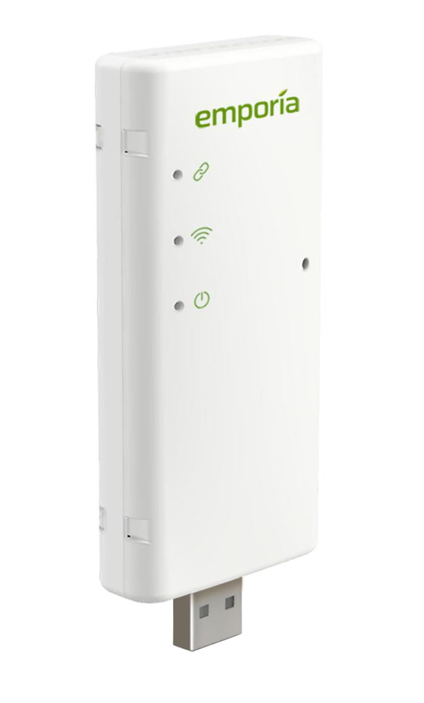

# ESPHome Emporia Vue Utility Connect Unofficial Firmware



This project provides **unofficial ESPHome firmware** for the [Emporia Vue Utility Connect](https://shop.emporiaenergy.com/products/utility-connect) - a small device that wirelessly reads your utility meter to report real-time energy usage.

Normally, the Vue sends your data to Emporia’s **cloud servers**, and the only way to access it is through the Emporia mobile app. This project enables you to flash custom firmware, built with ESPHome, to report **directly to Home Assistant** over Wi-Fi. That means:

- Your energy data stays local.
- You get real-time readings in Home Assistant.
- You can build automations, dashboards, and long-term storage however you like.

For a more detail overview: [Basics Explained](docs/basics.md).


**⚠️ Disclaimer**: This project is not supported by Emporia.
- This is community software, with no guarantee of reliability or safety. Use at your own risk.  
- Flashing this firmware will stop the Vue from sending data to Emporia’s cloud service, and the Emporia app will no longer work.  You should back up the original firmware first if you want to revert later.

<br>

## More information

This document links to other sections in this project.

- [Basics Explained](docs/basics.md)
- [Installing ESPHome](docs/installing_esphome.md)
- [Wiring and USB adapter](docs/wiring_and_usb.md)
- [Backup original firmware](docs/backup_firmware.md)
- [YAML Configuration](docs/yaml.md)
- technical details:
  - [Protocol Details](docs/protocol.md)
  - [Hardware Pinouts](docs/pinout.md)
  - [Meter Reading](docs/protocol-meter-reading.md)

Need help?
- See the: [FAQ](docs/faq.md)
- The [Community thread](https://community.home-assistant.io/t/emporia-vue-utility-connect/) has accumulated years of useful information about this project, and the place to go for help.

<br>

## What you'll need

**1. First: Check Utility Compatibility**
- Start here: [How the Vue Utility Connect Works](https://www.emporiaenergy.com/how-the-vue-utility-connect-works/).  
  Emporia publishes a list of supported utilities. Examples include PG&E (CA), SCE (CA), PPL (PA), ComEd (IL), AEP (TX).  
- Read the [detailed instructions](https://help.emporiaenergy.com/en/articles/9084294-how-does-the-vue-utility-connect-work).  
Note: There is a **pairing process**. It is advisable to pair the Vue with your utility meter using the stock firmware and the Emporia app first.

**2. Hardware**
- **Emporia Vue Utility Connect** — purchase from [Emporia’s store](https://shop.emporiaenergy.com/products/utility-connect).
- **USB-to-Serial adapter** — required for initial flashing.  See: [Wiring and USB adapter](docs/wiring_and_usb.md)
- **Basic wiring hardware and skills** — you will need to open the Vue and connect to a row of through-hole pads.  See: [Wiring and USB adapter](docs/wiring_and_usb.md)
- USB type A Power Supply **(optional)** - some Emporia USB power supplies have failed, which can appear like the device is powered but not working.  You may want to use something else.

**3. Software**
- **ESPHome** — the toolchain to build the firmware and flash it onto the Vue.  There are options.  See: [Installing ESPHome](docs/installing_esphome.md)
- **ESPHome integration for Home Assistant** — this guide uses the [official integration](https://www.home-assistant.io/integrations/esphome).

<br>

## Steps

### 1. Pair the Vue device with your smart meter.

The Vue Utility Connect device needs to be [paired with your smart meter](https://help.emporiaenergy.com/en/articles/9084294-how-does-the-vue-utility-connect-work) to work.  Think of it like pairing a bluetooth device.  The exact process is specific to your utility.  Pairing is done on the Smart Meter side, using the unique IDs from the Vue device.  Essentially pairing is configuring the Smart Meter so it will respond to the Vue.

Once paired, flashing the firmware of the Vue does not break the pairing.  Those unique codes are not part of the firmware, they are part of the hardware.  So the Vue can still read the meter.

Let's say you flash your Vue device and it's working, but later your smart meter is replaced.  You can pair your Vue device with the new smart meter with the custom firmware installed.

So should you flash the Vue with this firmware as soon as you receive it?  This is not advised.  **It is better to pair it with stock firmware** and use the Emporia App to confirm it is working.  This is the supported way to do so, and if you have any problems you can get the support of Emporia.

**Note:** The Vue device needs to wirelessly talk to your meter and your Wi-Fi at the same time to properly function.  So it needs to be located within range of both, and it is best to work in such a location.  This is important whenever you expect the device to be working (pairing the device, and testing it after flashing).


----

### 2. Wire up the device to a USB to TTL adapter

To both backup the stock firmware, and flash the firmware the first time, you need to do so with wires and a USB to TTL serial adapter.  This is usually a one-time thing.  Once the firmware is installed and the device is on your network, subsequent flashing can be done over Wi-Fi.

See the [Wiring and USB adapter](docs/wiring_and_usb.md) section.

----

### 3. Install ESPHome

There are two main ways to run ESPHome.  You may want to use both.

See the [Installing ESPHome](docs/installing_esphome.md) section.

-----

### 4. Back up the original firmware

This is an optional step.  If you want to be able to restore the original firmware on the Vue device and get the Emporia app to work again, you need to back up the firmware so you can later restore it.

See the [Backup original firmware](docs/backup_firmware.md) section.

----

### 5. Create a YAML configuration

Pick one of the [example YAML files](example_yaml/) in this project as a starting point. The simplest one is `vue-utility-simple.yaml`, but if you want to send fewer datapoints to Home Assistant, then choose one of the `throttled` files.

In any case, you will need to customize it.
1. for ESPHome CLI, you will do this in a text file on your computer.
2. for ESPHome Device Builder, you will do this within the Device Builder editor of the Home Assistant UI.

Minimally, you need to fill out this section of the YAML file.  By default, ESPHome looks in a file called `secrets.yaml` for them.

```
wifi:
  ssid: !secret wifi_ssid
  password: !secret wifi_password
```

So either edit the yaml file directly with your credentials, or put them in a separate `secrets.yaml` file like this (you can do so both ways with the CLI and Device Builder):

```
wifi_ssid: "MyHomeWiFi"
wifi_password: "supersecretpassword"
```

Some YAML configurations include an MQTT section.  If you don't know what this is, just remove it.  You do not need it.  If you use MQTT and want to read the data via MQTT topics, fill it out.
```
mqtt:
  broker: !secret mqtt_broker
  id: vue_utility
  username: !secret mqtt_username
  password: !secret mqtt_password
  discovery: False # Only if you use the HA API usually
```

----

### 6. Compile and Flash:

Whether you use the ESPHome CLI or the Device Builder, the first time you flash you will need to do this with a USB to TTL Adapter.  After that, you will be given the option to flash over Wi-Fi, which is much faster.

**Reminder:** triple check your wiring, making sure you are not connecting +5V to anything other than pin 6.  You can now plug it into your computer and the Vue device should power up and start working as normal.  ESPHome will flash it when it comes time.

You would do **ONE** of these steps depending on which [ESPHome Install method](docs/installing_esphome.md) you picked:

#### A) For ESPHome CLI:

You **do not need to clone this git repo**.  Even though this project has custom code in it (Python and C++), ESPHome will download the latest custom code from this project automatically from GitHub as part of the compilation step.  Assuming you called this file `vue-utility-simple.yaml` from the previous step, you would run:

```
esphome run vue-utility-simple.yaml
```

This should build the firmware and flash the device all on the command line.

**-- OR --**
#### B) For ESPHome Device Builder:

- Go to the [ESPHome Device Builder Add-on](https://esphome.io/guides/getting_started_hassio/).
- Click `Open web UI`.
- Follow the UI to create a device.
- Paste the YAML code into the editor and customize it as above.
- Click `Install`.

This should build the firmware and flash the device all within the web browser:
- ESPHome compiles the firmware on your HA server.
- ESPHome can flash the Vue over USB when it is either:
  - connected to the HA server, or
  - connected to your computer (using WebSerial)


----

### 7. Install ESPHome Integration in Home Assistant

Install the [ESPHome Integration](https://www.home-assistant.io/integrations/esphome) in Home Assistant.  You can you do this ahead of time of course.

----

That's it.

If everything works, Home Assistant will detect the Vue and automatically create a device and associated sensor entites.  You should be able to read your energy usage immediately.  See [Basics Explained](docs/basics.md) for what that looks like.

#### Bonus:

Set up the [Energy Dashboard](https://www.home-assistant.io/home-energy-management/) in Home Assistant.  Just go to the `Energy configuration` page and:
 - add `Utility Watt-hours Consumed` to `Grid consumption`
 - add `Utility Watt-hours Produced` to `Returned to Grid`

<br>


## Outputs

The output values are all _optional_ and categorized into instantaneous power (aka. watts) and total energy usage (aka. watt-hours) in 'import', 'export', and 'net' variations. Their relationship is: `net = import - export`

#### Watts

- **power** = Net watt usage at that moment in time. Is negative if you have excess solar generation.
- **power_import** = Watt usage from the grid at that moment in time. Is `0` if your solar generation currently exceeds your usage.
- **power_export** = Watts sent to the grid at that moment in time. Is `0` if you are using more than your solar is generating.

#### Watt-hours

This is a total energy usage count for the lifetime of your utility meter. The only situations where the count will decrease is if the 32bit value experiences an integer overflow, or if your utility meter is replaced with a new one. For either situation, it is expected that the count(s) will reset to `0`.

- **energy** = Total net watt-hour usage.
- **energy_import** = Total watt-hours taken from the grid.
- **energy_export** = Total watt-hours sent to the grid. Is perpetually `0` if you don't have solar generation.

<br>


</br>

## YAML Configuration

You likely can benefit from tweaking the YAML.  We have a dedicated section on [YAML configuration](docs/yaml.md).

</br>

## FAQ

Got Questions?  Check out the [Frequently Asked Questions](docs/faq.md).  Then head to the [Community thread](https://community.home-assistant.io/t/emporia-vue-utility-connect/).

</br>

## Meaning of LEDs

There are three LEDs on the device, which have "power", "wifi" and "link" icons stenciled on the case.

- **Power** = An ESPHome status led. Slowly flashing means warning, quickly flashing means error, solid on means OK. See [status_led](https://esphome.io/components/status_led.html) docs.
- **Wi-Fi** = Normally solid on, will briefly flash each time a meter rejoin is attempted which indicates poor signal from the meter.
- **Link** = Flashes off briefly about once every 5 seconds. More specifically, the LED turns off when a reading from the meter is requested and turns back on when a response is received. If no response is received then the LED will remain off. If this LED is never turning on then no readings are being returned by the meter.

## More Details

There are more technical documentation available:
  - [Protocol Details](docs/protocol.md)
  - [Hardware Pinouts](docs/pinout.md)
  - [Meter Reading](docs/protocol-meter-reading.md)

