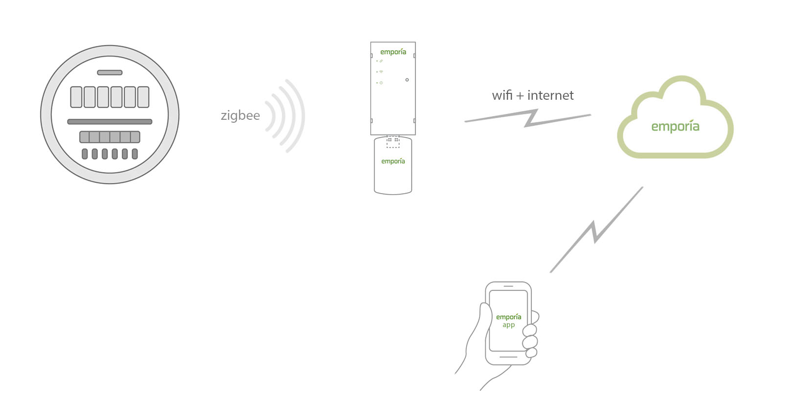
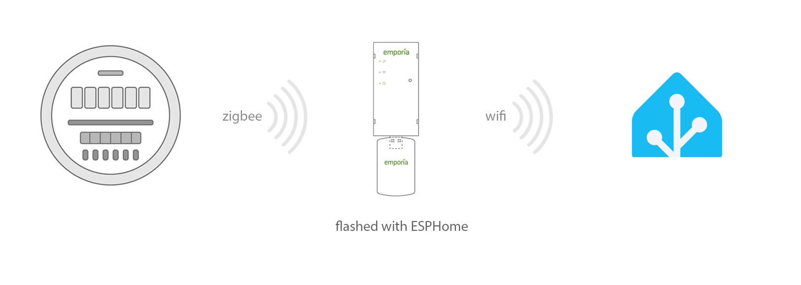
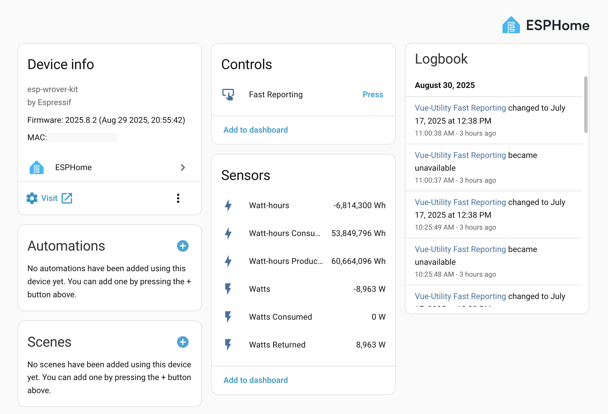
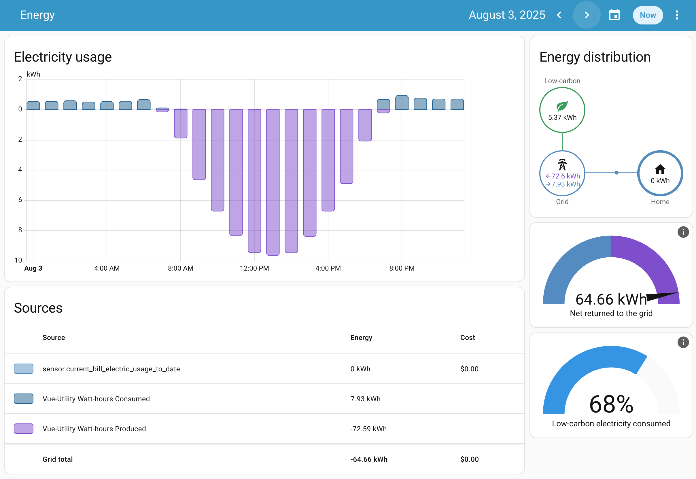

# Basics Explained

The [Emporia Vue Utility Connect](https://shop.emporiaenergy.com/products/utility-connect) is a small device you can buy online.  It plugs into any standard USB A power supply, and Emporia ships the unit with one.  It wirelessly connects to some utility smart meters to read real-time energy usage.

Note that it is only compatible with some utilities, and you will need to pair it with your smart meter.

## With stock firmware
Once paired and working, it reads your meter every 30 seconds and sends that to Emporia cloud servers via your home wifi and internet.  You can access that information using the Emporia app on a smart phone.  Your smart phone does not connect directly to the Vue device.

## With this ESPHome firmware
If you want this data in Home Assistant, this project provides firmware built with ESPHome that you flash to the Vue device.
- It overwrites the stock firmware.
- Once flashed and working, the Vue device will push data to Home Assistant.  It will no longer send data to Emporia servers, and the Emporia app will no longer work.  Note that you can back up the stock firmware, and restore it later if you need to.
- You can customize the firmware.  For example, I have mine reading the meter every 15 seconds.

## What is this data?

Since the Emporia Vue Utility Connect reads directly from your utility smart meter, the data you see is the **official measurement** used by your power company.
- **Real-time power flow** — how many watts your home is currently pulling from or sending to the grid (if you have solar panels).  
- **Cumulative totals** for both import and export, which makes the data compatible with the **Home Assistant Energy dashboard**.  

## What you get in Home Assistant
The ESPHome Integration is quite magical.  Once your device is flashed and running, Home Assistant automatically detects the Vue and creates a device record with sensor entities.  These can be used to build automations, dashboards, and long-term storage however you like.

### Energy dashboard
You can add the cumulative sensors **Watt-hours Consumed** and **Watt-hours Produced** to Home Assistant’s [Energy dashboard](https://www.home-assistant.io/home-energy-management/). This provides a polished and feature-rich view of your energy usage and production.

