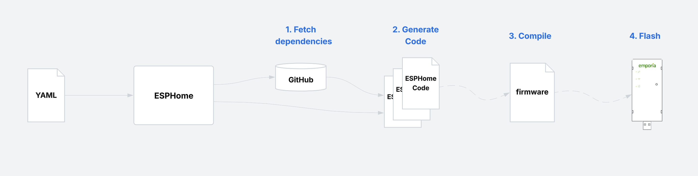

# Installing ESPHome

## Introduction

If this is your first time to [ESPHome](https://esphome.io/), the terminology can be confusing. You may hear "flash ESPHome on your device", but that’s not a totally accurate statement.

ESPHome is a **framework and toolchain** for creating custom firmware. This usually involves:
- Writing a short YAML configuration file, and optionally providing custom code.
- Using ESPHome software to:
  - Compile that configuration (and maybe custom code) into custom firmware.
  - Flash that firmware onto a device.

So when you hear someone say "a device running ESPHome", what they really mean is "a device running firmware built with ESPHome".

There are multiple ways to do this and much of the documentation out there is difficult for new comers.  This document walks you through:
- The high level of ESPHome.
- The two of the ways to use ESPHome to build and flash the firmware for this project.

## Overview

You will interact with two distinct parts of ESPHome:  
1. **ESPHome** — this is software you will use this to back up the stock firmware, compile this project, and flash the Vue.  There are two main ways to do this, with some caveats.
2. **ESPHome Integration** — you only need to install the [ESPHome Integration](https://www.home-assistant.io/integrations/esphome) in Home Assistant.  It is quite magical.  Once the Vue is flashed and running on Wi-Fi, it will auto-discover it and create the sensor entities automatically.

### How ESPHome works
With ESPHome, you pass it a YAML configuration file and it will:
1. Fetch dependencies
2. Generate code
3. Compile it into firmware
4. Flash the Vue

 

There is an overwhelming amount of documentation on writing a YAML file.  You do not need to start from scratch.  There are [example_yaml files](../example_yaml) in this project to get you started, which you just need to complete (mostly just your wifi credentials).

### The two main ways to run ESPHome

#### 1. ESPHome CLI --- [install guide](https://esphome.io/guides/installing_esphome/)

This gives you a CLI (command-line interface) to run ESPHome.  You run this in the terminal of your computer: Windows, Mac or Linux.  It is completely separate from Home Assistant.  It does not run with or on Home Assistant, and does not talk to it in any way.
 - You simply run: `esphome run <yaml_file>`
 - Runs on your own computer (Python or Docker).
 - Better for developers: quick iteration, local editing of YAML/Python/C++.
 - Flexible: you can use local custom code without publishing to GitHub.
 - Full control over build logs, debugging, and advanced options.
 - You **can backup the original firmware** with this.

#### 2. ESPHome Device Builder --- [install guide](https://esphome.io/guides/getting_started_hassio/#installing-esphome-device-builder)

This is a Home Assistant add-on.  It is basically a UI wrapper for the ESPHome CLI, and runs on the Home Assistant server.  You use the Home Assitant web interface to access it.
 - You use an in-browser editor to paste YAML code
 - Runs inside Home Assistant (web UI).
 - Better for end users: simpler UI.
 - Initial flashing still happens on your PC.  It works using WebSerial (via a browser).
 - You **cannot use this to backup the original firmware**.

### What is best for you?

- If you are adamant about [backing up the original Vue firmware](backup_firmware.md), minimally install the CLI just to get the backup step done.  You can use either the CLI or the Device Builder to program and flash, and you can switch between them at any time as well.

- If you like working from the command line and want full control, the ESPHome CLI is straightforward: you write YAML in a text file, build, and flash. It’s lean, reproducible, and great if you’re already comfortable with terminals.

- The Device Builder adds a friendlier interface.  It’s easier for beginners, integrates neatly with Home Assistant, and makes troubleshooting or rebuilding devices more point-and-click.
