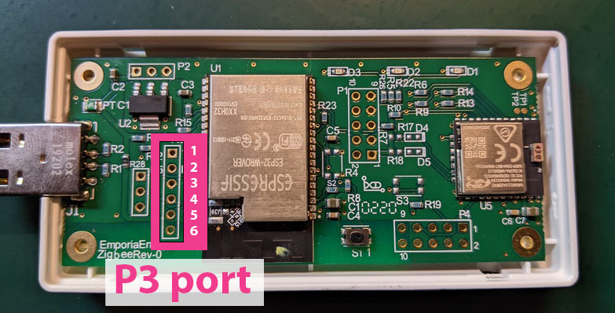
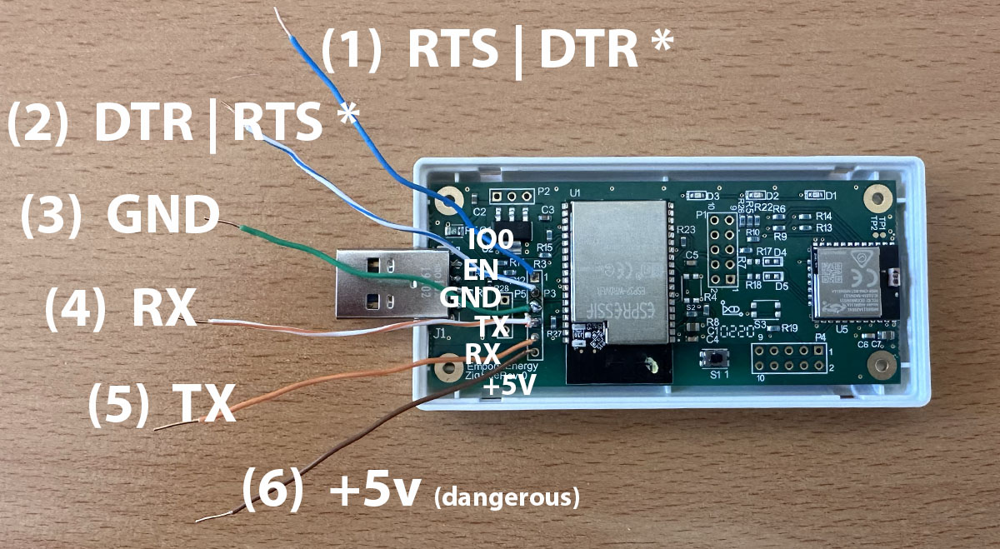
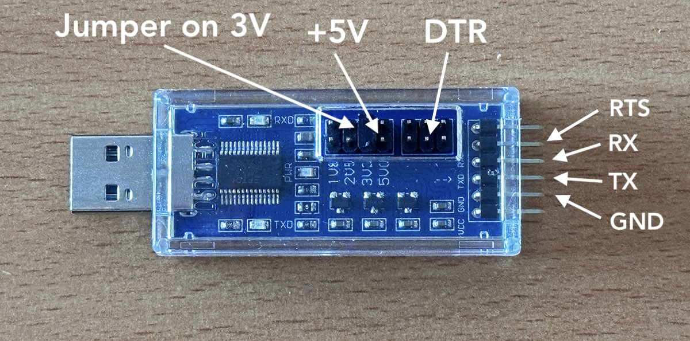

# Wiring and USB Adapter

The [ESPHome documentation covers this subject](https://esphome.io/guides/physical_device_connection/), but not this specific device.

### 1. You need a USB to TTL Serial Aapater

You will need a USB to TTL serial adapter.  Almost any adapter will work.  It needs to supply 3.3V signaling, and preferrably also provide a supply of 5V.

I can confirm this one works :- [Amazon: DSD TECH SH-U09C5 USB to TTL serial adapter](https://www.amazon.com/dp/B07WX2DSVB)

### 2. Wire up to port "P3"

You need to open the cover of the Vue device, and locate the port marked "P3".

The port pins consist of through holes and you will need to wire them up to USB to TTL adapter.  There are many ways to do this. I chose to solder some Cat 5 wires directly to the board, and used a breadboard and Dupont jumpers to wire those to the USB adapter.  See pictures below.

 
 

### 3. Connections

This is the how each pin should be wired to the usb adapter:

| Pin | Description | Connect to USB-TTL |                       |
| --- | ----------- | -------------------| --------------------- |
| 1   | IO0         | RTS or DTR **(*)** | 3.3 volts             |
| 2   | EN          | DTR or RTS **(*)** | 3.3 volts             |
| 3   | GND         | GND                |
| 4   | TX          | RX                 | 3.3 volts             |
| 5   | RX          | TX                 | 3.3 volts             |
| 6   | +5v         | +5v                | 5v to power the board |

 
NOTES:

- You **must use 3.3V signaling**.

- Pin 6 (the pin just above the text "EmporiaEnergy") is 5 volts, not 3.3v.  It is used to power the device.  **Do not to apply 5V to the wrong pin** or magic smoke may come out.  You can avoid connecting pin 6 by plugging in the device into a regular usb power supply/port to provide power.

- (*) The wiring depends on the USB to TTL serial adapter you are using.
  - For example, the [DSD TECH SH-U09C5 USB to TTL serial adapter](https://www.amazon.com/dp/B07WX2DSVB), Pin 1 is DTR and Pin 2 is RTS.
  - Nothing will be damaged if these are swapped.
  - If one way of wiring does not work, swap pins 1 and 2.
  - This has tripped quite a few people.  See below for a more complete explanation.

 

These are the pins on the [DSD TECH SH-U09C5 USB to TTL serial adapter]((https://www.amazon.com/dp/B07WX2DSVB)):

Here is an example of how to do this:

 

## Why are the instructions for Pins 1 and 2 **"to just swap them if they don't work"?**

ESP32 needs two lines to enter the UART bootloader:

- **EN** (reset): pulse low to reset the chip
- **IO0** (boot select): hold low while EN rises to boot into the loader

Flashing tools (like `esptool`, used by ESPHome) do not have “EN/IO0” pins. They drive **DTR** and **RTS** (modem control signals) in a specific timing pattern that assumes:

- **DTR → EN**
- **RTS → IO0**

On some USB-serial adapters, those labels or polarities are effectively flipped. That’s why you’ll sometimes need to swap the connections.

Many ESP32 dev boards (NodeMCU/WROOM devkits) hide this logic behind transistors/inverters, so you never think about it. **Bare USB-TTL dongles expose raw DTR/RTS**, where names and polarity are not standardized.
- **Label drift:** Some boards label the header “RTS” where the chip is actually driven like DTR (or vice-versa).
- **Polarity/inversion:** CH340, CP210x, FTDI, etc. often invert DTR/RTS differently. A vendor may “fix” this on the PCB without changing the silkscreen names.
- **Hidden glue logic:** Dev boards add transistors that cross-wire/invert the signals so any mapping “just works.” Bare adapters do not.
- **Manual bootloading masks wiring errors:** If you short IO0 to GND at power-up, flashing will work even if DTR/RTS are wrong—making the bad mapping look “fine.”

---

### Symptoms that your mapping is wrong

- `esptool` can’t sync unless you use `--before usb_reset` or you physically unplug/replug.
- Flashing completes, but the device won’t reboot cleanly unless you power-cycle.
- You must keep holding IO0 to GND by hand for it to work.

Those all mean EN/IO0 aren’t being driven with the expected timing and polarity.

---

### “But my adapter has a dedicated RESET pin…”

`esptool` does not drive arbitrary “RESET” header pins. It toggles only DTR/RTS. Unless your adapter internally mirrors DTR to that RESET header, using it won’t help the auto-sequence. Stick to DTR/RTS.

---

### Why `--before usb_reset` sometimes works

The underlying `esptool` has a `--before usb_reset` option, which can work. It avoids DTR/RTS entirely by bouncing the USB device. That can momentarily create the right conditions for the bootloader, but it’s crude and unreliable. It also explains why some people need to manually unplug/replug after flashing. Fixing EN/IO0 mapping makes this unnecessary.

